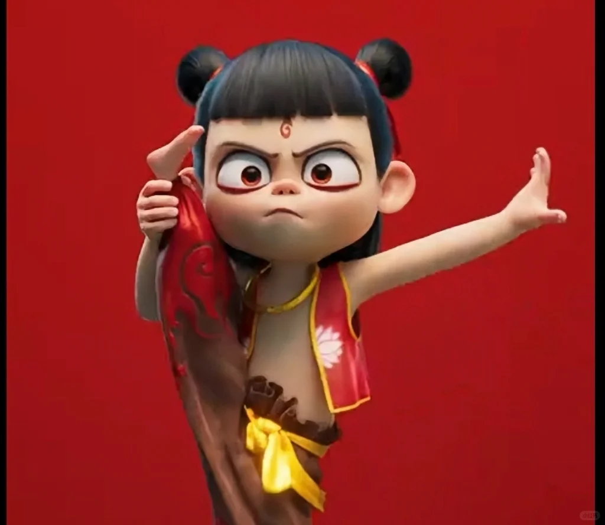
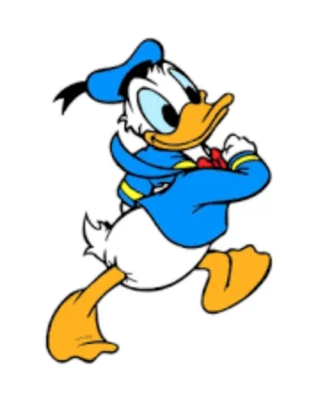
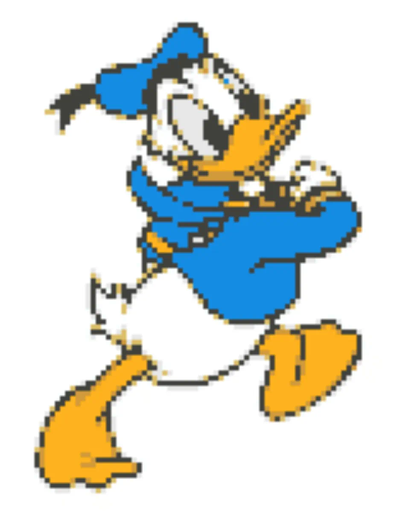
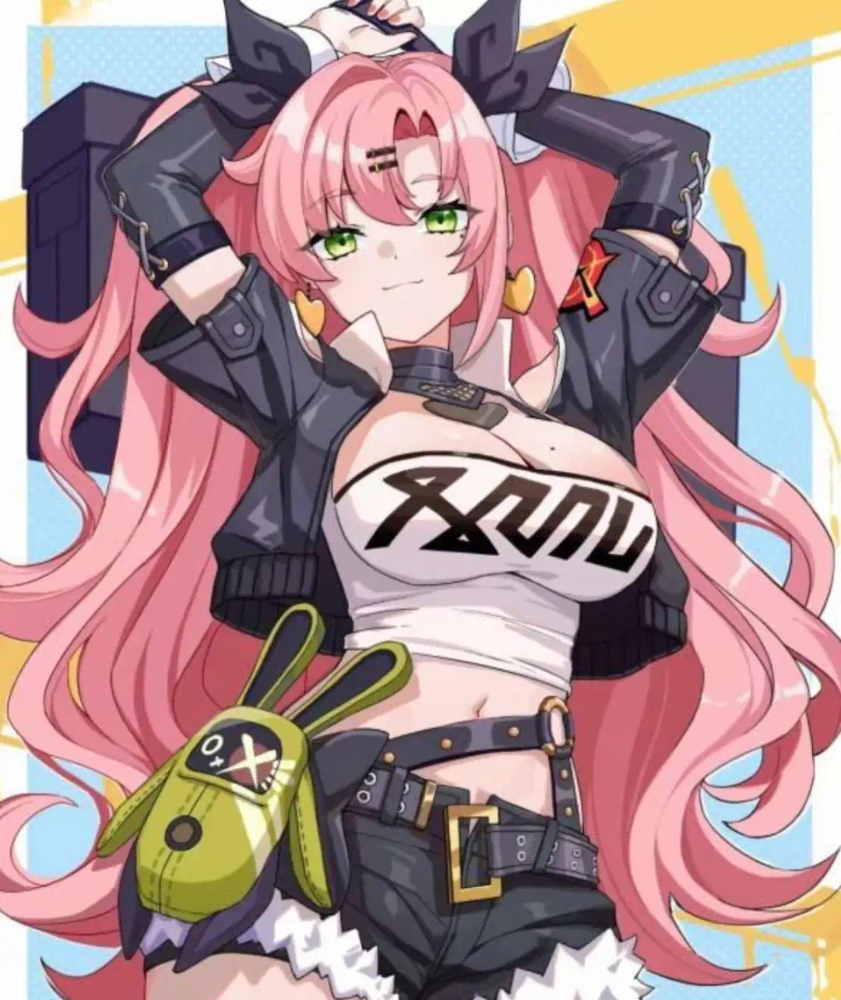
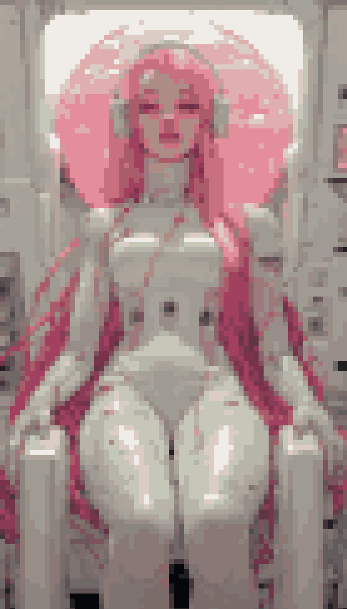

# Pixel Art Generator

A web-based tool that converts regular images into pixel art with customizable settings.

| Original | Result |
|----------|--------|
|  |  |
|  |  |
|  |  |
|  |  |

## Version 1.0.1 Updates

### New Features & Optimizations

1. **Anti-Aliasing Removal**
   - Added background color detection
   - Automatically removes anti-aliasing artifacts between object and background
   - Configurable threshold for AA removal sensitivity

2. **Large Image Handling**
   - Automatic image scaling for large inputs
   - Maintains aspect ratio
   - Default maximum dimensions: 800x600px
   - Disabled image smoothing for better pixel art quality

### Technical Details

#### Background Color Detection
- Samples corners of the image to determine background color
- Calculates average RGB values for consistent detection

#### Anti-Aliasing Removal Algorithm
- Uses color distance comparison
- Default threshold: 30 (adjustable)
- Replaces similar colors with exact background color

#### Image Scaling
- Dynamic scaling based on input dimensions
- Preserves aspect ratio
- Uses nearest-neighbor scaling for pixel-perfect results

## How to Use

1. Upload an image using the file input
2. Adjust settings:
   - Block Size: Controls pixel size
   - Color Count: Sets the number of colors in the final image
3. The image will be automatically processed with:
   - Scaled dimensions (if needed)
   - Pixel blocking
   - Color quantization
   - Anti-aliasing removal
4. Download the result using the save button

## Technical Requirements

- Modern web browser with HTML5 Canvas support
- JavaScript enabled
- Recommended browsers: Chrome, Firefox, Safari, Edge

## Features

- Easy-to-use interface
- Real-time preview
- Adjustable pixel block size (2-10 pixels)
- Customizable color palette (2-64 colors)
- Download results as PNG
- No installation required - works in browser
- Improved mobile viewing experience

## Project Structure

```
web/
├── css/
│   └── style.css      # Styles
├── js/
│   └── main.js        # Core functionality
└── index.html         # Main page
```

## Local Development

Simply clone the repository and open `web/index.html` in your browser. No build process or dependencies required.

```bash
git clone htts：//github.com/JobYu/pixel-art-converter.git
```

## Version

Current version: v1.0.1

- Added CSS media query to hide the original image container on mobile screens (width <= 768px)
- Adjusted the result container to take full width and provide better height utilization
- Improved mobile viewing experience by focusing on the converted result

v1.0.0

- Easy-to-use interface
- Real-time preview
- Adjustable pixel block size (2-10 pixels)
- Customizable color palette (2-64 colors)
- Download results as PNG
- No installation required - works in browser


## License

Copyright © 2024 [32comic.com](https://32comic.com). All rights reserved.

## Acknowledgments

Thanks to [Pixel It](https://github.com/giventofly/pixelit) for the inspiration.
