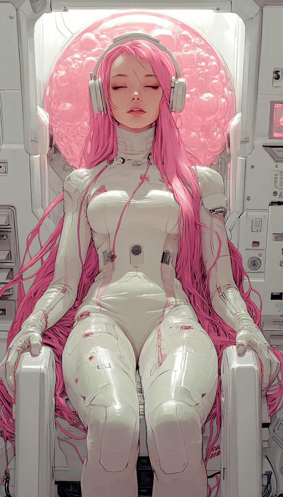

# image2pixel

A web-based tool that converts regular images into pixel art with customizable settings.

| Original | Result |
|----------|--------|
|  |  |
|  |  |
|  |  |

## Version

Current version: v1.0.5


v1.0.5

- Added support for perler bead (拼豆) blueprint export
- Added 7 built-in fuse bead brand palettes (Perler, Hama, Nabbi, Artkal)

v1.0.4

- Added support for Print

v1.0.3

- Added support for images with transparency (alpha channel)

v1.0.2

- Added grid display feature
- Improved download button interaction

v1.0.1

- Added CSS media query to hide the original image container on mobile screens (width <= 768px)
- Adjusted the result container to take full width and provide better height utilization
- Improved mobile viewing experience by focusing on the converted result

v1.0.0

- Easy-to-use interface
- Real-time preview
- Adjustable pixel block size (2-20 pixels)
- Customizable color palette (2-64 colors)
- Download results as PNG
- No installation required - works in browser

### Technical Details

#### Background Color Detection
- Samples corners of the image to determine background color
- Calculates average RGB values for consistent detection

#### Anti-Aliasing Removal Algorithm
- Uses color distance comparison
- Default threshold: 30 (adjustable)
- Replaces similar colors with exact background color

#### Image Scaling
- Dynamic scaling based on input dimensions
- Preserves aspect ratio
- Uses nearest-neighbor scaling for pixel-perfect results

## How to Use

1. Upload an image using the file input
2. Adjust settings:
   - Block Size: Controls pixel size
   - Color Count: Sets the number of colors in the final image
3. The image will be automatically processed with:
   - Scaled dimensions (if needed)
   - Pixel blocking
   - Color quantization
   - Anti-aliasing removal
4. Download or print the result using the Save or Print buttons
   - Print function automatically fills A4 page
   - Grid display is preserved when printing (if enabled)

## Desktop Version on Steam

A desktop version of this pixel art generator is now available on Steam! Built on the same algorithm, the desktop application offers additional features and convenience.

**[Image2pixel-PixelArtGenerator on Steam](https://store.steampowered.com/app/3475120)**

If you enjoy this web tool, please consider adding the desktop version to your Steam wishlist. Thank you for your support! 🙏

## Technical Requirements

- Modern web browser with HTML5 Canvas support
- JavaScript enabled
- Recommended browsers: Chrome, Firefox, Safari, Edge

## Features

- Easy-to-use interface
- Real-time preview
- Adjustable pixel block size (2-20 pixels)
- Customizable color palette (2-64 colors)
- Download results as PNG
- Print results directly from browser
- No installation required - works in browser
- Improved mobile viewing experience

## Project Structure

```
web/
├── css/
│   └── style.css      # Styles
├── js/
│   └── main.js        # Core functionality
└── index.html         # Main page
```

## Local Development

Simply clone the repository and open `web/index.html` in your browser. No build process or dependencies required.

```bash
git clone htts：//github.com/JobYu/image2pixel-web.git
```

## Chrome Extension

This repository also includes a Chrome Extension in `chrome-extension/` that opens a popup for image-picking settings, and can also convert one image via the browser right-click menu.

### Load unpacked

1. Open `chrome://extensions`
2. Enable `Developer mode`
3. Click `Load unpacked`
4. Select the `chrome-extension` folder from this repository

### Usage

1. Open any webpage with images
2. Click the `Image2Pixel Picker` toolbar icon to open the popup
3. Adjust `Pixel Size` and `Color Count`, then click the `Select Image` button in the popup
4. Return to the page and click the image you want to convert
5. To convert only one image without entering pick mode, right-click that image and choose `Convert this image to pixel art`

The extension no longer injects its page runtime by default. The content script is injected only when the user opens the popup flow or uses the right-click conversion action. If the extension needs to fetch the original image bytes from a specific image host, Chrome will request optional site access for that host instead of granting broad access up front.

### Chrome Web Store release files

The release-ready store materials live here:

- `chrome-extension/store/chrome-web-store-listing.md`
- `chrome-extension/store/privacy-policy.md`
- `chrome-extension/store/release-checklist.md`
- `web/chrome-extension-privacy-policy.html`

These files include:

- English and Traditional Chinese listing copy
- Permission justification text
- An extension-specific privacy policy draft
- A pre-submission checklist for screenshots, packaging, and dashboard fields

### Packaging for submission

Before uploading to the Chrome Web Store, package the contents of `chrome-extension/` as a ZIP archive. The `store/` folder can stay in the package because it does not affect runtime behavior, but it is safe to exclude if you prefer a smaller upload artifact.

## License

Copyright © 2024 [image2pixel.app](https://image2pixel.app). All rights reserved.

## Acknowledgments

Thanks to [Pixel It](https://github.com/giventofly/pixelit) for the inspiration.
